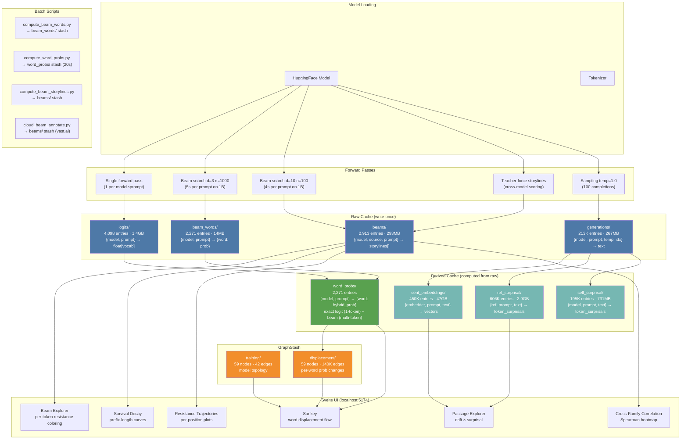
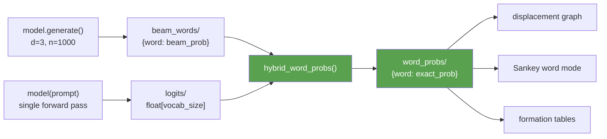
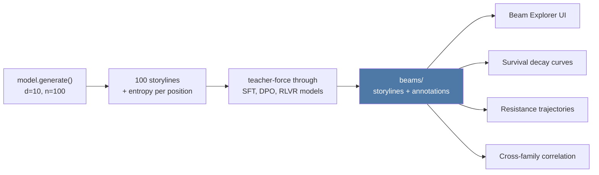

# Data Pipeline

## Overview

## Stash Inventory

| Stash | Entries | Size | Source | Key |
|-------|---------|------|--------|-----|
| **logits/** | 4,098 | 1.4GB | Single forward pass | `{model, prompt}` |
| **beam_words/** | 2,271 | 14MB | Beam d=3 n=1000 | `{model, prompt, n, depth}` |
| **beams/** | 2,913 | 293MB | Beam d=10 n=100 + teacher-force | `{model, source, prompt, ...}` |
| **word_probs/** | 2,271 | ~5MB | Hybrid: logits + beam_words | `{model, prompt}` |
| **generations/** | 213,081 | 267MB | Sampling temp=1.0 | `{model, prompt, temp, idx}` |
| **mega_generations/** | 6,250 | 91MB | Sampling + per-position entropy | `{model, prompt, temp, idx}` |
| **sent_embeddings/** | 449,877 | 46.6GB | bge-m3 on generations | `{embedder, prompt, text}` |
| **ref_surprisal/** | 605,800 | 2.9GB | Pythia/GPT-2 on generations | `{ref, prompt, text}` |
| **self_surprisal/** | 195,483 | 731MB | Model on own generations | `{model, prompt, text}` |
| **word_embeddings/** | 18,120 | 570MB | Contextual word vectors | `{model, prompt, word, k}` |
| **reasoning_logits/** | 24 | 44MB | R1-Distill thinking+logits | `{model, prompt}` |
| **top_words_v2/** | 886 | 7MB | Legacy: discover_top_words | `{model, prompt, k}` |
| **score_vocab_v2/** | 913 | 14MB | Legacy: first-token approx | `{model, prompt}` |
| **trees/** | 6 | 491MB | Legacy: tree exploration | `{model, prompt, ...}` |
| **psyche_derived/** | 4,718 | 5.4GB | Legacy: migrated backup | mixed |

## Word Probability Pipeline

**Single-token words** (kill, throw, die, scream — 85% of words):
exact logit softmax P(token). No approximation.

**Multi-token words** (strangle, vomit, puke — 15% of words):
beam path probability = P(tok1) × P(tok2|tok1) × ... (chain rule via beam search).

## Storyline Pipeline

Each storyline carries:
- `tokens[]`, `token_texts[]` — the sequence
- `path_prob`, `log_prob` — beam score
- `entropy[]` — full-vocab entropy at each position
- `annotations{}` — per-annotator `token_resist[]`, `total_resist`
