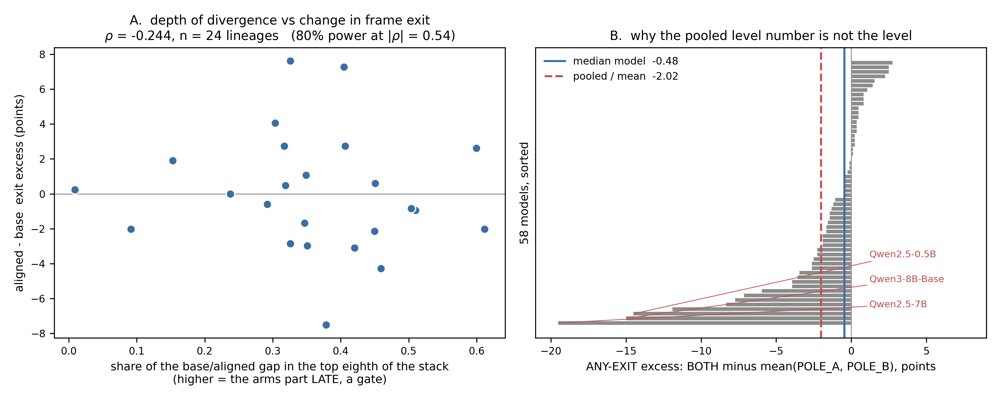

# The depth of divergence does not predict frame exit

**Status: NULL, and the null is informative.** 24 English lineages, 60,480
generations, every test above p = 0.15. The Chinese half is null in the same
places on 25 lineages and 63,000 generations.

Producer `scripts/z_depth_exit_join.py`; figure
`scripts/z_depth_exit_figs.py`; tables `results/z_exit_f11l2_cells.csv` and
`results/z_depth_exit_join.csv`. Commissioned by `TODO.md`, which specified the
question, the instruments and the unit before anything ran.

---

## The question, and why the answer had teeth either way

Two M02 instruments had never been put in the same room.

The **lens** says at which DEPTH the base and aligned arms of one lineage stop
agreeing on a contradiction prompt. `lens_analysis.py` reports that the
divergence is late: 0.339 of the total gap falls in the top eighth of the stack
against 0.111 for an even spread, on 35 of 38 lineages, p = 6.7e-08.

The **markers** say whether the continuation LEAVES the frame, and into what.
The JS ratio can license "the continuation is unrelated to the poles" and can
never license "the model exited" -- that is a claim about the destination.

A late gate is cheap, reversible and cosmetic: a mask over a computation that
still ran. That reading carries real political-economic weight, and it has been
resting on the lens alone. **If the gate is what produces the exit, the depth of
divergence should predict the exit rate.**

It does not.

## The result

| test | statistic | p |
|---|---|---|
| depth (top-eighth share) vs d exit excess, ANY-EXIT | rho = -0.238 | 0.26 |
| depth (argmax) vs d exit excess, ANY-EXIT | rho = -0.250 | 0.24 |
| size of the divergence vs d exit excess | rho = -0.002 | 0.99 |
| **output-level** JS contrast vs d exit excess | rho = -0.011 | 0.96 |
| late-parting groups vs early-parting, within lineage | -1.75 pp | 0.21 |
| alignment's effect on exit excess at all, ANY-EXIT | -0.30 pp, 12/24 | 1.00 |

24 tests in the primary table; one nominal hit (E-MENTION on argmax, rho =
-0.426, p = 0.038) against 1.2 expected by chance, in the wrong direction for a
gate, and absent in Chinese. It is not reported as a result.

**What the n can and cannot exclude.** 24 lineages gives 80% power at
|rho| = 0.54. Every observed |rho| is below 0.43, so a strong coupling is ruled
out and a weak one is not. That is the honest boundary of this null and it is
drawn on the figure rather than left in the prose.

## What it means

The lens result stands, and its interpretation narrows. The arms of a lineage
do part late; that is measured, replicated on 35 of 38 lineages, and unaffected
by anything here. What this shows is that **the lateness does not travel to the
surface.** Lineages whose arms part at depth 0.61 do not exit the frame any
differently from lineages whose arms part at 0.01.

So the depth story is a fact about the READOUT, not a fact that predicts
behaviour, and the sentence "a late gate is cheap, reversible and cosmetic"
cannot be supported by pointing at the exit markers. It may still be true. It is
not evidenced by these two instruments agreeing, because they do not.

The stronger version of the same point is in row four of the table. **The
output-level JS contrast -- the instrument M02 has been reasoning with all along
-- predicts the exit markers at rho = -0.011.** Not weakly: not at all. The
distribution-level claim that the continuation is unrelated to the poles and the
passage-level claim that the continuation left the frame are, on this substrate,
unrelated measurements. Whatever the ratio is measuring, it is not the event the
markers see.

## Three things about the substrate, recorded because each cost something

**The role column is empty.** All 228,520 f11_l2 rows carry `role = ''`, so the
role comes from `data/prompt_categorisation.json` matched on prompt TEXT. The
JSON is the source of truth for what a prompt is; the DB for what was generated.

**Five prompt texts occupy more than one slot, and one of them changes role.**
`'The human stood in the clearing and began to'` is POLE_A of `f11_species` AND
POLE_B of `f11_species_wolf`; four others are shared in the same role across
variant groups. A map keyed on text keeps the last writer -- which starves four
groups of an arm, and in the species case would hand one group the other's pole.
The map is one-to-many and each generation is credited to every slot it fills.

**A per-cell rate on 20 generations cannot be averaged.** A cell holds exactly
20 generations, so a cell rate moves in 5-point steps and a cell excess in
2.5-point steps. The first version of this analysis took the median of per-cell
excesses per lineage and returned **exactly +0.000 for all eight marker types**,
which reads as a null and is an artefact of snapping a coarse quantity to its
mode. Pooling counts before forming a rate gives each lineage arm ~400 passages
per role. The conclusion did not change. The evidence for it became real.

## And the level: contradiction does not exit more, and the pooled number lies

A by-product worth recording, since the pooled figure is arresting and wrong.

Over every English passage, BOTH prompts exit the frame LESS than single-pole
prompts: 12.12% against 13.66 and 14.62, an excess of **-2.02 points** on
73,080 passages, 24,360 per role. That number is a mean, carried by three --
Qwen2.5-7B at -19.5, Qwen3-8B-Base at -15.0, Qwen2.5-0.5B at -14.5. The median
model is at **-0.48**, a quarter of it. At the lineage unit the effect is
14 of 25 negative, p = 0.69, and in Chinese the pooled excess is +0.08 points.

**There is no general tendency for contradiction to change frame exit in either
direction.** There is a Qwen tendency, on English, which is a different claim
and a smaller one. Panel B of the figure is that distribution, because a
sentence saying "the pooled value is unrepresentative" is weaker than the
picture of 58 bars with the mean sitting outside the body of them.

## The coded outcome, tried: four fields unrunnable, one hypothesis

`scripts/z_depth_exit_coded.py` re-runs the join against the L2 treatment coder
(`malign_logits/tasks/code_m02_l2_treatment_v1.py`) instead of the regexes --
565 deduped non-degenerate passages, 22 lineages, 402 passages in the join.

**It mostly cannot be run, and the file says so before it says anything else.**
The coded corpus is a SPREAD sample: a median of ONE passage per (model, group)
cell, so a lineage arm rests on ~9 passages and a difference of two such rates
carries a binomial SE near 20 points. Comparing the observed between-lineage
spread against what binomial sampling alone would produce:

| field | base | aligned | sd obs | sd noise | reliability |
|---|---|---|---|---|---|
| frame_exit | 35.4% | 40.3% | 0.211 | 0.219 | **0.00** |
| tension_named | 8.3% | 14.3% | 0.193 | 0.129 | 0.56 |
| tension_deliberated | 5.3% | 7.1% | 0.112 | 0.105 | **0.13** |
| tension_enacted | 8.3% | 9.2% | 0.106 | 0.119 | **0.00** |
| refusal | 0.0% | 1.0% | 0.039 | 0.037 | **0.07** |

Four of five are noise. A correlation against a quantity that is entirely
sampling error is attenuated to zero **whatever is true**, so a null on those
fields would be a fact about the annotation budget and not about the world; they
are not reported. Reaching reliability 0.5 would need roughly 76 coded passages
per lineage arm, about 3,300 in total.

**`tension_named` survives at 0.56, and gives rho = -0.412, p = 0.057 against
argmax depth.** The regex run's single nominal hit was E-MENTION on the same
statistic, rho = -0.426, p = 0.038. Same sign, near-identical magnitude, two
instruments.

That is worth exactly one check and it was run: **the E-MENTION regex fires on
0 of the 56 spans the coder quoted for `tension_named`.** They are not one
measurement scored twice -- E-MENTION catches metalinguistic QUOTATION ("words
like", "the term 'x'"), `tension_named` catches a passage naming its own
contradiction in ordinary prose ("an incoherent mess of lust and rage"). So the
agreement is not an artefact. **It is also not corroboration**, because they are
not the same claim: two weak signals, same direction, different constructs.

Both are negative, which is the OPPOSITE of the gate prediction -- lineages
whose arms part later show a SMALLER alignment-driven rise in naming. If that
were real it would be interesting. On this evidence it is a hypothesis with a
direction, drawn from two multiple-comparison-laden tables, and it should be
registered and tested rather than cited. **It is not a result and is not
indexed as one.**

## What would settle it

Nothing about generation volume: 129,000 passages were available and the join
used 60,480 of them, so more data does not move this. What limits it is that
24 lineages is the population, and lineages are the unit because cells are not
independent (ICC 0.85 on comparable material). To detect |rho| < 0.5 the roster
would have to grow, which is a fleet question and not an analysis one.

The other route is a better outcome variable. These are surface regexes,
declared before reading and reused here verbatim, and `y_exit_typology.py` says
in its own header that they will miss paraphrased exits and fire on in-scene
dialogue, with the direction of that error unknown rather than conservative. A
coded pass on the same cells would test whether the null survives a measurement
that can see a paraphrase. Until then this null constrains the regex-visible
exit, which is what the lens was going to be compared against anyway.
