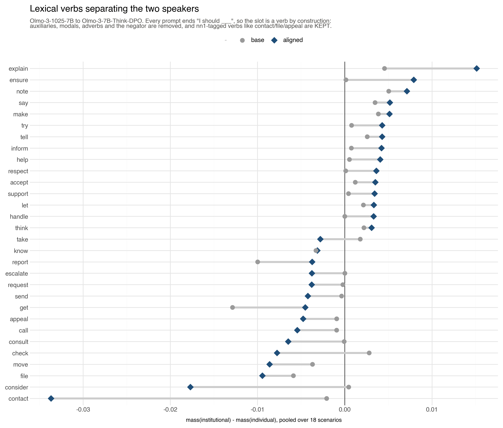
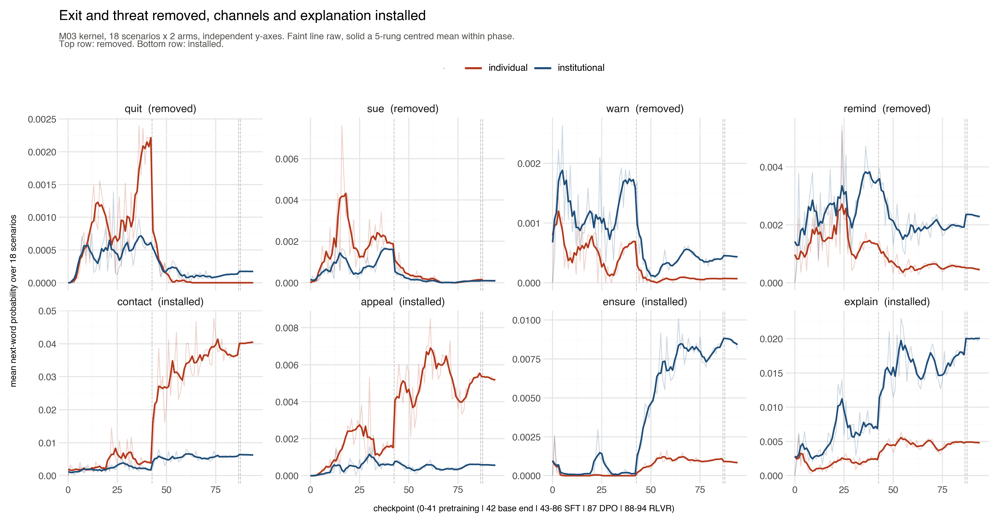
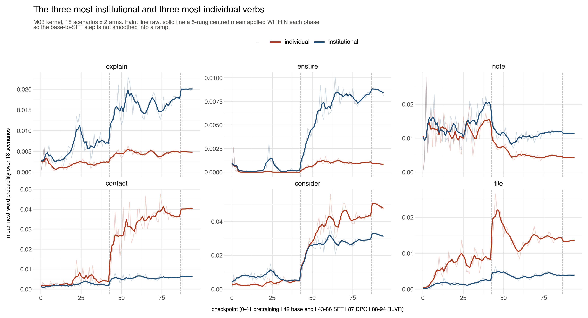
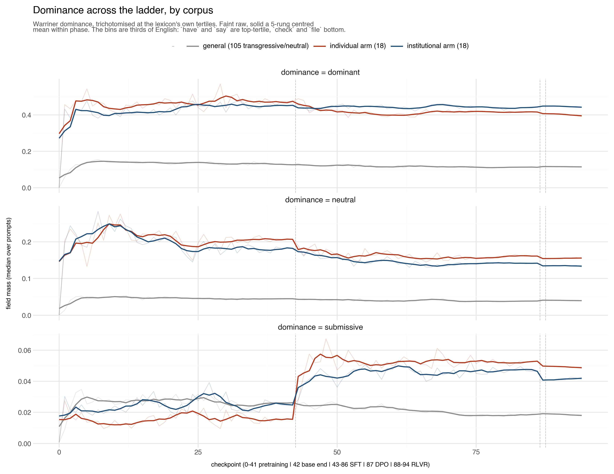

# Findings D: alignment selects from a repertoire pretraining already built

Written 2026-08-11. Producers: `scripts/d_ladder.py`, `d_ladder_fields.py`,
`e_general_vs_institutional.py`, `f_figures.py`. Population: the M05 checkpoint
ladder, 95 rungs of one Olmo-3 lineage, on the M03 speaker kernel's 18
scenarios x 2 arms and F21's 12 mirrors x 2 arms. Zero new compute; both were
already in the M05 battery.

**STATUS: one lineage.** Everything here is a trajectory on a single family,
and the significance claims are at the SCENARIO unit with 12, 18 or 30 items.
Plan B's cross-section (46 lineages) remains the instrument for population
claims; this is the instrument for *shape* and *timing*. Where the two speak to
the same question, plan B wins and this document says so.

---

## 1. The headline

Alignment does not build the institutional/individual vocabulary split. **It
selects it, from a repertoire pretraining had already assembled, and it does so
almost entirely inside SFT's first few thousand steps.**

    verb      pretraining max        SFT end       ratio
    contact   0.00889 (ckpt 22)      0.02124        2.4x
    ensure    0.00253 (ckpt 1)       0.00481        1.9x
    explain   0.00807 (ckpt 22)      0.01123        1.4x
    appeal    0.00343 (ckpt 30)      0.00307        0.9x
    quit      0.00169 (ckpt 36)      0.00007        0.04x
    sue       0.00463 (ckpt 16)      0.00011        0.02x

`appeal` reaches a *higher* mass during pretraining than it holds at the end of
SFT. `contact` is at nearly half its final level by checkpoint 22 of 42. The
words alignment promotes and the words it deletes are all present, at the same
order of magnitude, before alignment begins.

**That is why the effect is sudden.** Construction is slow: a representation
has to be built. Selection is immediate: the alternatives are already in the
distribution and only their relative weights move. The step change at the first
SFT rung is itself evidence that nothing is being learned, only re-ranked.

What SFT supplies is not the vocabulary but the **selection rule over it**: it
makes the choice consistent, where pretraining's `contact` wanders
unsystematically (0.0028, 0.0027, 0.0031, 0.0075, 0.0028 across rungs 1-41),
and it makes the choice **conditional on who is speaking**, which pretraining
never does.

This is F21's surviving headline -- *the deference gap is in pretraining, not
alignment* -- arriving at word level and made more precise. The REPERTOIRE is
in pretraining; what alignment adds is the selection over it.

---

## 2. Which verbs, and in which direction

Pooled over the 18 M03 scenarios, base against aligned. Grey circle is the base
model, blue diamond the aligned one, and the grey line is the move alignment
makes. Right of zero is institutional.

    INSTITUTIONAL   explain, ensure, note, say, tell, inform, make, try,
                    help, respect, accept, support, let, handle
    INDIVIDUAL      contact, consider, file, check, consult, call, appeal,
                    send, request, escalate, report, move, seek

Three groups rather than two. The institution is told to **communicate
outward** (`explain`, `inform`, `tell`, `note`) and to **accommodate** (`help`,
`respect`, `accept`, `support`, `let`). The individual is told to **reach
someone and file** (`contact`, `consult`, `call`, `send`, `file`, `appeal`,
`request`, `escalate`).

**The accommodation verbs are the surprise and they cut against M03's own
title.** `accept`, `respect`, `support` and `let` go to the INSTITUTION. Read
with the appeal verbs on the other side, this is not the institution being made
bureaucratic --- it is the institution being told to yield and explain while
the petitioner is routed into formal channels.

Almost all of it is created rather than inherited: `ensure` +0.0001 to +0.0079,
`handle` +0.0000 to +0.0033, `respect` +0.0001 to +0.0036, `contact` -0.0021 to
-0.0337. The base model barely distinguishes the two speakers on any of them.

### The verb filter is the SLOT, not the lexicon

Every prompt ends `I should ___`, so the next word is a lexical verb by
construction. Filtering IN by BYU's `vv*` tag drops `contact`, `file`,
`document`, `appeal`, `report`, `review` and `request` -- all tagged `nn1`
because they are commoner as nouns in general English, and all verbs here.
**That filter removes exactly the words that carry the result.** So the filter
removes what CAN follow a modal without being lexical -- auxiliaries, modals,
adverbs, the negator -- and keeps everything else.

---

## 3. Removal is general; installation is role-assignment

    verb      base end (inst / indiv)      RLVR end (inst / indiv)
    quit        0.0006  0.0022               0.0002  0.0000
    sue         0.0016  0.0019               0.0001  0.0001
    warn        0.0016  0.0007               0.0004  0.0001
    remind      0.0035  0.0013               0.0023  0.0004
    contact     0.0017  0.0038               0.0062  0.0404
    appeal      0.0006  0.0015               0.0005  0.0050
    ensure      0.0001  0.0000               0.0081  0.0008
    explain     0.0069  0.0023               0.0204  0.0048

**The removals are near-total and arm-blind.** `sue` collapses to 0.0001 on
BOTH arms; `quit` reaches exactly zero for the individual. Alignment does not
reallocate these between speakers, it deletes them from the slot for everyone.

**The installations are strongly arm-specific.** `contact` goes to 0.0404 on
the individual arm against 0.0062 on the institutional; `appeal` is
individual-only; `ensure` and `explain` mirror it on the other side. Whether
this is roster-wide is a separate question and is taken up below; `ensure` is
so far the one shown to be.

So the two halves work by different mechanisms. **Removal is a prohibition;
installation is a role assignment.** The model does not stop the petitioner
suing and hand suing to the institution -- it stops suing, then tells the
petitioner to make contact and the institution to explain.

Read together with §2: alignment **removes the options that would take the
dispute outside the institution's own machinery** -- quitting, suing -- and
substitutes the machinery's procedures, while disarming the institution's
threats (`warn`, `remind`) and making it explain itself. Both speakers are held
inside one channel, from opposite ends.

### WHERE THIS SITS RELATIVE TO THE 46-LINEAGE CROSS-SECTION

Everything above is measured on ONE lineage and is true of it. The question the
cross-section can speak to is a different one -- whether the same pattern is
roster-wide -- and it is worth being exact about why the two do not simply
check each other.

Plan B's word table (`results/b_word_delta_by_word.csv`) reports a DIFFERENT
QUANTITY on a DIFFERENT POPULATION: the paired delta contrast (change under
alignment, inst minus indiv, within lineage x scenario x condition) over the
full 252-text kernel across all seven conditions. The ladder reports a mass
difference at the endpoint over the 36-text `I_final` slice. Same words, not
the same measurement.

On plan B's quantity, at the lineage unit:

    word       median_d   lin>0    d_indiv    d_inst
    ensure     +0.00155   42/46   +0.00137   +0.00171
    sue        +0.00150   39/46   -0.00197   -0.00143
    quit       +0.00056   35/46   -0.00160   -0.00147
    remind     +0.00031   33/46   +0.00021   +0.00068
    explain    +0.00036   27/46   -0.00005   +0.00032
    warn       +0.00004   24/46   -0.00090   -0.00013
    appeal     -0.00016   22/46   +0.00025   -0.00015
    contact    -0.00067   14/46   +0.00148   +0.00084

**Two things are roster-wide.** `sue` and `quit` fall in BOTH arms across 46
lineages, so the removal is not an Olmo peculiarity. And `ensure` carries an
arm contrast at 42 of 46, so the institutional side's strongest installed verb
generalises.

**The rest is, so far, an Olmo result.** `contact` at 14/46 on plan B's
quantity is not evidence against its elevenfold individual-side rise here --
that rise is measured and stands -- but it does mean the arm-specific
installation has not been shown roster-wide, and on the closest available
cross-sectional measurement it is not. Same for `explain`, `warn` and `appeal`.

**The Olmo trajectory is therefore a hypothesis about the other 45 lineages**,
and a sharp one, because the ladder can say things a cross-section cannot: that
the change is a step at the first SFT rung, that DPO and RLVR add nothing, and
that the vocabulary was present in pretraining. None of that is testable
without checkpoints, and Olmo is the only lineage on this roster that has them.
The way to settle it is a second ladder --- Pythia's is registered --- not a
cross-sectional table computed on other quantities.

### Held to what it will bear

These are small masses. `quit` starts at 0.0022, so "removed entirely" is a
fifth of a percent of the distribution, honest about direction and modest about
magnitude. `remind` is the weakest of the eight (0.0035 to 0.0023, a third,
where the others move by factors of 4 to 40) and should not carry the coercion
reading alone.

---

## 4. The timing, and what the ladder adds

Everything happens inside SFT, mostly in its first third. DPO and RLVR are flat
on every verb measured. The three patterns visible here are worth separating:

- **created**: `ensure` is 0.0001 at the base -- effectively absent from this
  slot -- and alignment builds it to 0.0081 on the institutional arm.
- **suppressed less**: `note` FALLS in both arms and appears on the
  institutional side only because it falls less there. This is the third time
  in this campaign that a contrast has been driven by differential suppression
  rather than promotion, and per-arm columns are the only defence.
- **arm-blind riser**: `consider` rises sevenfold in BOTH arms and ends
  individual-leaning by a whisker (0.0474 against 0.0312). It is the largest
  riser in the population and is essentially not a speaker effect. Do not
  describe it as individual.

Of the six, `contact`, `ensure` and `explain` are genuine arm effects,
`consider` is a general alignment riser, `note` is suppressed-less, and `file`
is real but small.

---

## 5. Fields: dominance, once the measure is repaired

On the arm contrast, with light verbs excluded:

    dominance = dominant     +0.1303   24 of 30 scenarios   p = 0.00143
    dominance = submissive   -0.0308    8 of 29             p = 0.0241
    dominance = neutral      -0.1061    9 of 30             p = 0.0428

The institutional arm retains high-dominance content vocabulary where the
individual loses it. The words are `ensure`, `prioritize`, `handle`, `focus`,
`explain` on one side against `contact`, `consult`, `ask`, `respond`, `verify`
on the other -- acts of control against acts of petition, which is what
Warriner's dominance norm is measuring when it is allowed to.

**This is the fourth independent measurement of one distinction**: plan B's raw
word deltas, plan B's fields across 45 of 46 lineages, [4725]'s gloss on
another population and instrument (*"the individual petitions someone else, the
institution explains itself and processes internally"*), and this.

### Two repairs the measure needed, both recorded because both nearly cost the result

**The bins are TERTILES of the whole Warriner lexicon.** "Submissive" is the
bottom third of English and contains `check`, `file`, `take`, `fight`;
"dominant" is the top third and contains `have`, `say`, `know`, `get`. `ask` is
dominant and `demand` is neutral. Read naively, "dominance falls and submission
rises" was `have` falling and `file` rising -- the generic-to-specific verb
shift wearing a power label.

**But removing the light verbs STRENGTHENED the result rather than killing it**
-- +0.0807 to +0.1303, the same 24 of 30 scenarios, and the other two bins
going from null to significant. The light verbs were noise in the measure, not
its source. **A confound shrinks an effect when you remove it; a dilution grows
it.** That asymmetry is the diagnostic, and running it is what saved a real
finding from a premature retraction.

---

## 6. What the ladder CANNOT do, and it is the methodological result

**The magnitude question is dead on one lineage, and not because the effect is
absent.**

    unit = RUNG        F21  51/52 positive  p = 2.4e-14
                       M03   3/52 positive  p = 1.0e-11
    unit = SCENARIO    F21   7/12 positive  p = 0.774
                       M03   7/18 positive  p = 0.481
    BOTH POOLED        14/30 positive, mean d -0.0060, p = 0.86

An earlier version of this analysis reported the rung-unit numbers. **The 50
rungs are not 50 observations** -- they are 50 correlated snapshots of the same
12 or 18 scenarios, and the ICC of the paired difference across rungs is
**0.855** (F21) and **0.846** (M03): a scenario's value is fixed from the first
alignment checkpoint to the last.

At the scenario unit the item sd is **0.116 bits**, against a population
difference of 0.063. So:

    to detect an arm effect of  0.030 bits requires  118 scenarios
                                0.050                 43
                                0.065                 25
    available                                         12 and 18

**Plan B escapes this by architecture, not by luck.** Its unit is the lineage:
each of 46 contributes a median over 126 cells, which shrinks item variance by
about sqrt(126) before the between-lineage test runs. 41/46 and 44/46 are sound
and stand. A single-lineage ladder multiplies ROWS, not evidence.

**The rule this establishes: the ladder is for shape and timing; the
cross-section is for significance.** Any scenario-level claim needs the kernel
expanded to ~100+ scenarios, which is prompt authoring rather than analysis.

---

## 7. What alignment does GENERALLY does not transfer

Running registrar's instrument (`m05_field_flow_fine.py`, field mass over 287
fine fields, reference-free) unchanged on all three corpora:

    Spearman of field movement, 95 shared fields
      general vs institutional   0.063
      general vs individual      0.169
      institutional vs individual 0.701

What alignment does to the 105 transgressive/neutral narrative pairs is
essentially uncorrelated with what it does to the advice prompts, while the two
arms of the same corpus move together at 0.70. The largest general movers
mostly reverse on the arms.

**This cannot be attributed to institutionality.** The corpora differ in FORM
-- narrative continuation against "I should" advice -- as well as topic, and
that confound is not separable here. It is the same wall plan C hit. The arm
contrast is safe from it, since both arms are the same form; only the
general-versus-arms comparison is confounded.

---

## 8. Reproduction

    uv run python scripts/d_ladder.py --run              # magnitude
    uv run python scripts/d_ladder_fields.py --run --report
    uv run python scripts/e_general_vs_institutional.py --run --report
    uv run python scripts/f_figures.py --data --all      # every figure, 300 dpi

Figures use a 5-rung centred mean applied WITHIN `base_step`, `sft_step` and
`rlvr_step` separately, never across a phase boundary -- a window spanning the
base endpoint and the first SFT rungs would turn the step this document is
about into a ramp. The raw series is drawn faintly beneath. The rungs are not
evenly spaced in training steps, so the window is in checkpoint index, not
training time.

## 9. What this does not license

- **It is not a claim about alignment in general.** One lineage, and the
  cross-corpus comparison in §7 says field movement does not transfer between
  corpora even within this lineage.
- **It cannot measure agency**, and F21's addendum binds the narration: *"Agency
  RISES in every family... do not narrate submission."* Nothing here reopens
  that. The `submissive` bin in §5 is the bottom tertile of a norm rated on word
  forms out of context, and its members are `check`, `file` and `take`.
- **The selection reading in §1 is one verb short of clean.** `consider` goes
  from 0.0075 to 0.0364, a fivefold rise past anything pretraining reached, and
  looks like amplification rather than selection.
- **The pretraining maxima in §1 are maxima over 42 noisy rungs** and are biased
  upward by construction. The defensible claim is that the verbs are present in
  pretraining at the same order of magnitude, not that they reach a stated
  fraction of their final value.
