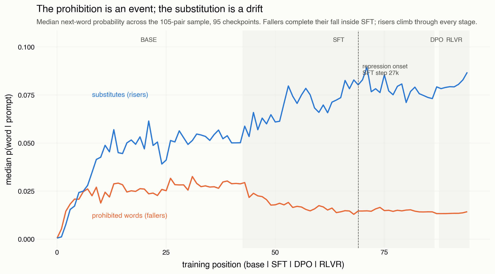
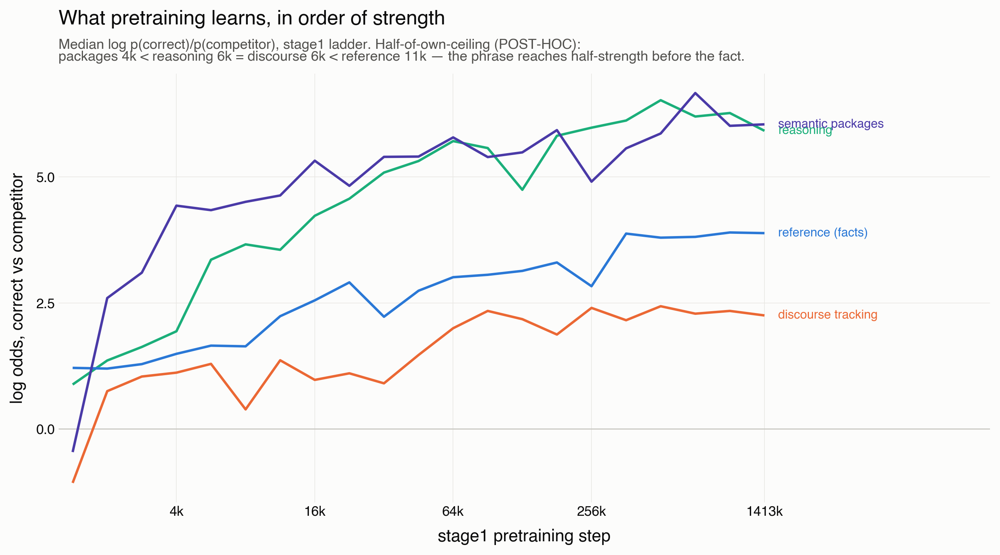
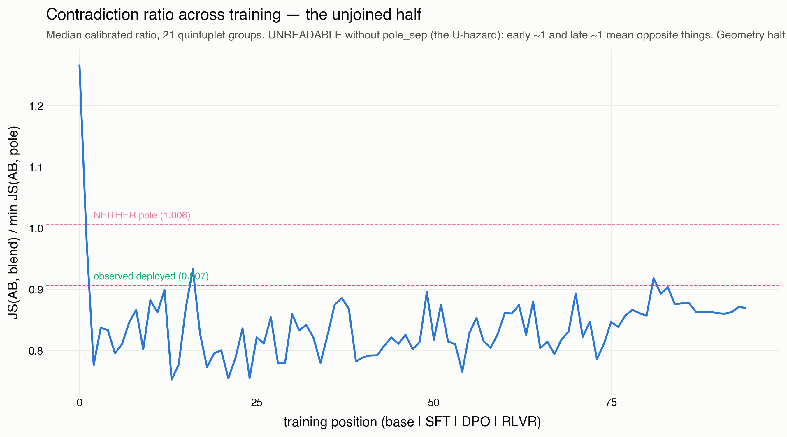

# Finding M05-A: the prohibition is an event, the substitution is a drift

Written 2026-08-11 by the registrar seat, the day the fleet landed. STATUS:
DRAFT, grade C — single run, single lineage (OLMo-3), no cross-seat audit
yet. Every number below re-derives from two commands:

    MALIGN_TWP_SOURCE=clickhouse uv run python meta/M05_emergence/scripts/m05_curves.py
    uv run python meta/M05_emergence/scripts/m05_onsets.py

Data: data/m05_curves.parquet (49,210 rows) over the frozen inputs —
battery 584 texts sha e5a4f5fb9f1f4907, population 95 checkpoints sha
495eee8deb6ca20a (base 42 + SFT 43 + DPO endpoint + RLVR 7 + 3 mains).
Plan: plans/a_thinksft_acquisition.md, priors written before the run.
Corpus custody: [5413]/[5414], both stores reconciled to the cell.

## The question

When in training do alignment's operations install? Specifically (the
registered primary, F04's question at 43-rung power): does repression
precede displacement within the SFT run?

## Result 1 (PRIMARY): repression is an event; displacement is a drift

The registered onset criteria give an asymmetry that is stronger and
stranger than the lag F04 reported at 10 checkpoints:

    FALLERS (the prohibited words, each prompt carrying its own from the
    105-pair sample): aggregate onset at SFT STEP 27,000 — the median
    separates from the base envelope and stays separated to the arm's end.
    Base-main CI [0.0229, 0.0394] -> SFT-final median 0.014.

    RISERS (each prompt's substitute): NO ONSET WITHIN THE ARM. The median
    rises 0.050 -> 0.074 (+48%) across SFT but never clears the base CI
    [0.044, 0.066] — and keeps rising AFTER the arm: +8% at the DPO
    endpoint (0.079), +10% more across RLVR (0.087 at step 1375).

    PAIRED per-site (threshold-free persistent-sign onsets): median lag 0,
    Wilcoxon p = 0.97, n = 44 sites with both onsets; 34 sites never
    persistently fall, 41 never persistently rise.

READING. F04's "repression precedes displacement" does not survive as a
lag between two onsets — at site grain there is no fall-then-rise
sequence (p = .97). What replaces it is a difference in KIND: the
prohibition completes within SFT as a detectable event; the substitution
accumulates gradually across the entire released pipeline, including the
preference and reinforcement stages whose raw next-word surfaces look
frozen (the 4-prompt raw probe read RLVR as "nothing"; the instrument
sees +10%). The substitute does not arrive after the prohibition — it
never stops arriving.

CAVEATS. Aggregate CI separation is a hard criterion at n=105 prompts;
the riser's non-onset is a statement about that criterion, not a null
about the rise (the +48% is visible in the medians). DPO is a single
endpoint (no vendor releases preference trajectories — [5382]); the
DPO/RLVR increments are two and seven points respectively. Absent words
enter at theta/2 with flags (rates: fallers 6.7%, risers 1.4%).

## Result 2 (BASE ARM): a four-way tie at the floor, and object
## permanence arrives sixteen times late

At the registered criterion (bootstrap CI of the median contrast > 0 at a
rung and every later rung):

    packages / reference / reasoning / poetic pull: onset at STAGE1-2000
      — the second rung with data, ~0.14% of pretraining
    discourse tracking (state/location/possession): onset at STAGE1-32000

The Weatherby ordering (poetic vs referential vs cognitive) is therefore
NOT RESOLVED at onset grain: everything except discourse clears "reliably
above chance" essentially at once. The one ordering fact the criterion
does deliver: holding a discourse model of the text — where the key is,
who has the umbrella — emerges an order of magnitude later than fact
completion, package completion, inference, and formulaic pull. Reference
as trivia is early; reference as WORLD-TRACKING is the late achievement.

MAGNITUDE SHAPES (first-look medians, labeled, CIs pending): packages
lead reference by ~3 nats at 16k (the phrase before the world); poetic
pull is non-monotonic (peak near 16k, dip, partial recovery) while its
capability floor rises monotonically — the pull/floor separation doing
exactly the work [5379] added it for. A time-to-half-max milestone would
resolve the ordering the onset criterion cannot; it is POST-HOC and runs
labeled as such if it runs (RH's word pending).

## Result 3: the true zero, and its Chinese twin

**QUALIFIED 2026-08-11 by the Pythia cross-lab arm ([5430]): the true zero
is OLMo's initialisation, not a fact about untrained networks.** Pythia's
step0 resolves ~5 words per cell (two wordless cells in 90,170); the
cross-lab test was the registered reason for that arm and it refuted the
generalisation on the first quantity read. The OLMo measurement below is
untouched; what falls is only the implied "untrained networks start at
zero." The Pythia population is its own file and its own finding, never
pooled with this one (different lab, tokenizer, corpus).

At stage1-step0, 257 of 584 cells are complete, conservation-exact
measurements resolving NO WORDS — a flat distribution over 100,278 tokens
sits fifty-fold below theta ([5413], confirmed both stores [5414]). On
THIS lineage the acquisition curve starts at a measured floor, not a small
number and not a gap. The same instrument reading appears wherever a model
meets a language it never acquired: 937 zh cells across 21 non-zh-lineage
models ([5420]) — the undifferentiated floor is one phenomenon in two
guises, and it is now readable rather than invisible ([5418] read-path
fix). The zh twin survives the Pythia qualifier unchanged: it is a claim
about unacquired languages at trained checkpoints, not about
initialisation.

## Result 4 (secondary): the frame axis, and an arrow that does not resolve

Secondary 4 asked whether the contradiction ratio and the pole-separation
geometry move together across the SFT rungs, and which leads (the arrow the
[5378] predictions were about). Both were computed on the English quintuplet
block: the calibrated contradiction ratio from twp, pole_sep from the hidden
sidecars (lacan's corrected within-layer instrument).

    LEVELS co-move on the SFT arm (Spearman +0.61, p 1.3e-05)
    RUNG-TO-RUNG changes are UNCOUPLED (co-drift rho -0.12, p .45)
    NO LEAD either way (sep-leads .085 / ratio-leads .17, both n.s.)

So the two rise together as "how much alignment has happened" but neither
drives the other at rung grain: the common-cause branch survives, which the
plan's own priors named as itself a result. The single sharpest geometric
fact is not the arrow but the first 1,000 steps of pretraining — pole
separation collapses 0.79 -> 0.23 there, dwarfing every later move including
all of alignment (spread -> collapse -> gradual re-separation). One
prediction was refuted and its falsifier withdrawn by its author: step0's
pole_sep is the LARGEST on the ladder, because an untrained net separates
inputs arbitrarily, and step0 is the random-init reference the instrument
lacked.

## Result 5 (secondary): the reasoning frame is template-keyed throughout

Raw-mode probe (no chat template) at the final RLVR checkpoint: p(first
`<think>` piece) sits at rank 3.5k-42k across four prompts, statistically
identical to every Think-SFT checkpoint. The reasoning frame never becomes
ambient; it lives entirely inside the template, from the first SFT step to
the last RLVR one. The raw next-word distribution barely moves under RLVR
(kill 0.035 vs SFT-final's identical), yet the instrument sees the riser
drift the anecdote could not (+10% across RLVR at battery grain) -- the
frozen surface and the continuing drift coexist.

## What this does to the standing findings

- F04 (unaudited, C): AUDITED AT 43 RUNGS AND ITS SPECIFIC CLAIMS FAIL
  ([5424], at RH's prompting): 'scream rises gradually from step 10000
  onward' -- at full resolution it rises 6k->9k, PEAKS at 9,000 (0.083),
  and is back to 0.040 by 10,000, exactly where F04 next sampled; its
  kiss pair peaks at 2,000 and DECLINES 61% into the late arm where F04
  reports a rise. 'F04's lag is an artefact of a 10-point grid with a
  5,000-step hole in it.' The direction-level supersession stands; the
  specific F04 trajectories do not. (F04 fingerprinted as OLMo by
  base-probability match -- its CSVs carry no model column.)
- F26 (Think-SFT ~3x displacement, Think-DPO ~0): refined — DPO adds
  little at the raw surface but the substitute's drift continues through
  it; "adds ~0" was a two-endpoint statement about a drift.
- Finding U (SFT carries 74%): consistent — the event lives in SFT; the
  drift is the "lower amplitude" of the other rungs, now seen as
  continuous.
- The RLVR raw-mode probe (register, 2026-08-11): scoped — template-keyed
  <think> and frozen top-8s coexist with a +10% riser drift the anecdote
  could not see.

## Not yet in this finding

Secondary 5 (the syntax curve) — needs the frozen licit-category artifact.
The join check (which base revision SFT descends from). Format-vs-correction
greedy coding. The field-flow, per-prompt, and affective-convergence results
have their own finding documents (B, C, D). Everything here is one lineage
(OLMo); the generalisable tests want the 46-lineage store and the held Pythia
arm.
