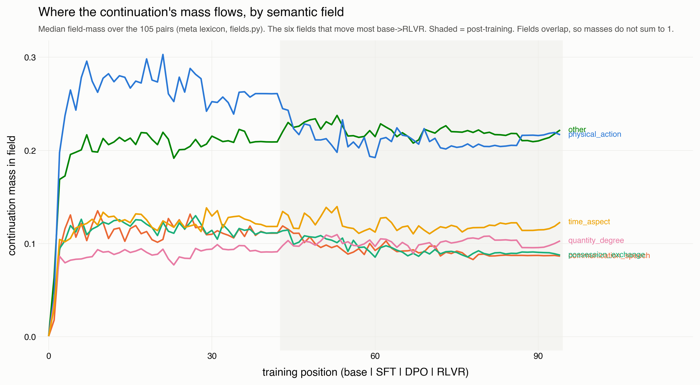
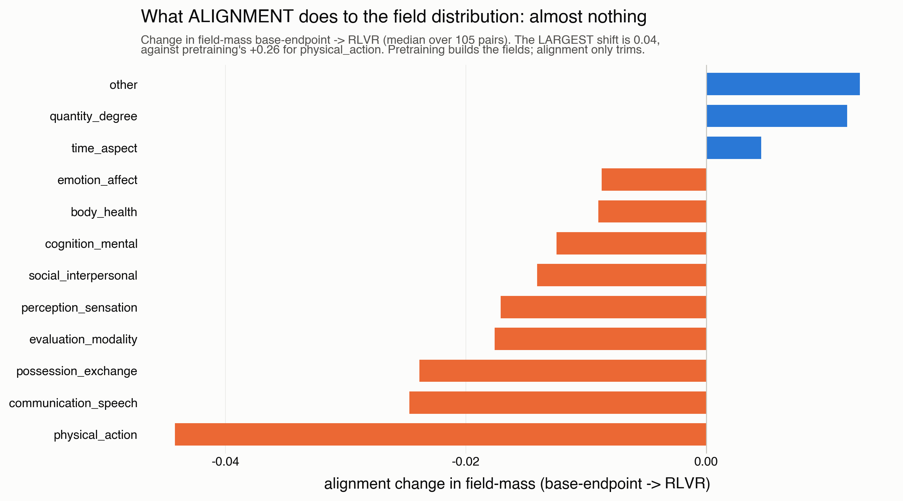
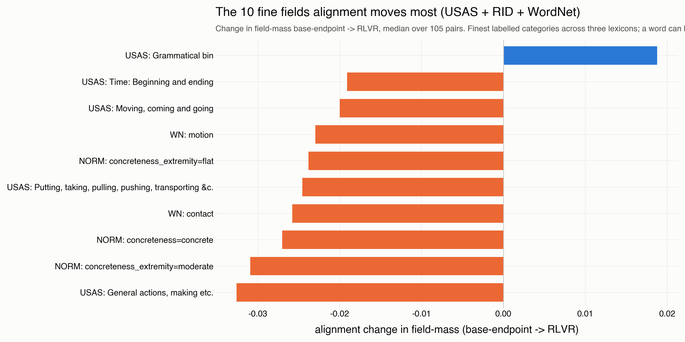
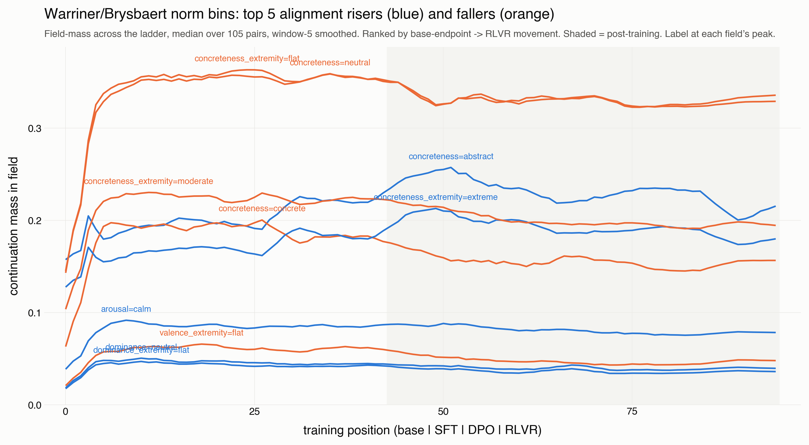
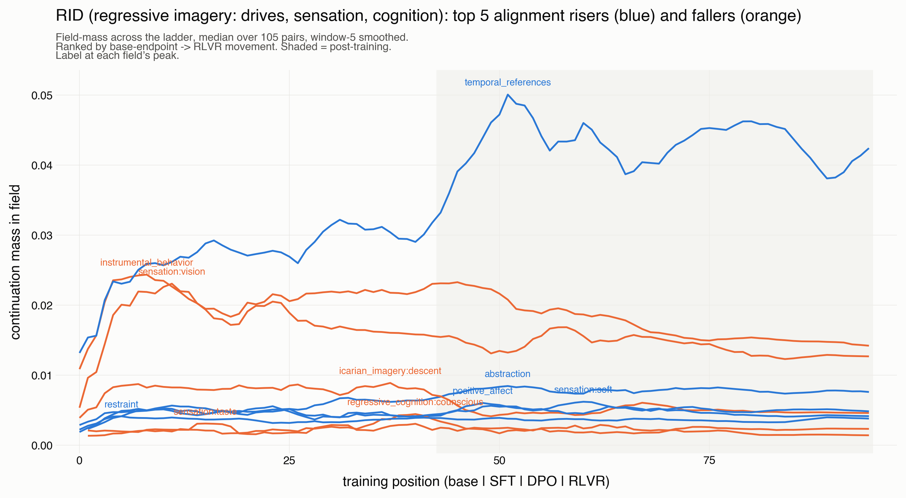
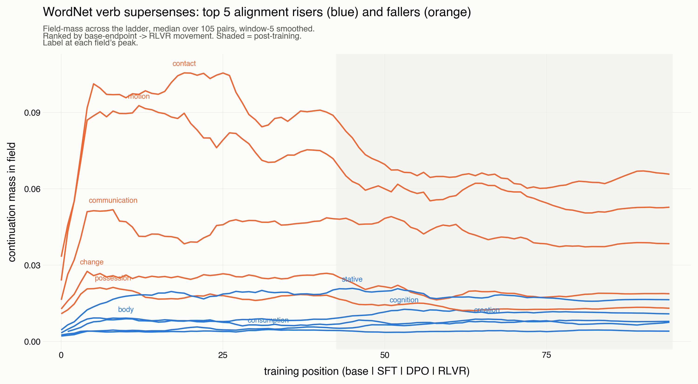
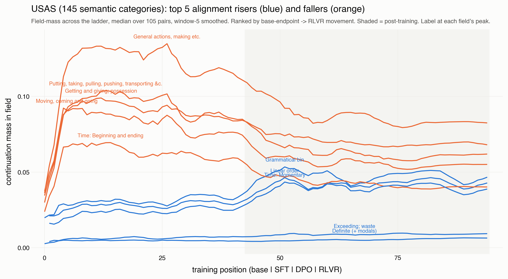

# Finding M05-B: alignment de-concretizes — the semantic-field flow of the continuation

Written 2026-08-11 by the registrar seat. STATUS: DRAFT, grade C — single
run, single lineage (OLMo-3), no cross-seat audit, no declared null on the
per-field ordering. Re-derives from:

    MALIGN_TWP_SOURCE=clickhouse uv run python meta/M05_emergence/scripts/m05_field_flow.py            # 13 meta-fields
    MALIGN_TWP_SOURCE=clickhouse uv run python meta/M05_emergence/scripts/m05_field_flow_fine.py       # 287 fine fields
    uv run python meta/M05_emergence/scripts/m05_field_flow_per_namespace.py                            # per-lexicon figures

Instrument: the repo's own lexicons (`malign_logits.fields`) run through the
twp distribution — for each candidate continuation word, look up its
field(s) and weight by the word's probability, giving field-mass = the
continuation probability landing in each field. Median over the 105 minimal
pairs, reference-free (each checkpoint read on its own distribution). Data:
`data/m05_field_flow_fine.parquet`.

## The question

When alignment moves the continuation distribution, WHICH semantic fields
does it move mass out of and into? Displacement rendered as field flow, not
total mass.

## Result 1: pretraining builds the field structure; alignment barely moves it

At the 13-field meta grain, every field is built from the true zero during
pretraining (physical_action 0.001 -> 0.261) and then only trimmed by
alignment (largest shift 0.04; summed field shift ~6x larger in pretraining
than in all of alignment). At this coarse grain alignment looks nearly flat —
correctly, because the word-level operations (kill->scream, dick->member)
move mass WITHIN a coarse bucket.

## Result 2: at fine resolution, the direction is coherent — de-concretization

Run every count()-supported lexicon at its finest (287 fields: raw USAS
decoded via the tagset, RID, WordNet, and the trichotomised norm bins). The
ten fields alignment moves most base-endpoint -> RLVR: nine of ten FALL and
are concrete-physical (general actions, putting/transporting, moving, contact,
motion), and — decisively — the concreteness norm itself falls
(concreteness=concrete -0.027) while the sole riser is the grammatical/
function bin. Alignment pulls the continuation off concrete physical action
toward grammatical/abstract.

## Result 3: the same direction in four independent lexicons

Split by namespace, every lexicon shows the same shift, at the SFT boundary:

- NORM: concreteness=concrete/neutral fall, concreteness=abstract rises
  (clean crossover at the SFT boundary), arousal=calm rises.
- RID (psychoanalytic): abstraction + temporal_references + positive_affect +
  restraint rise; instrumental_behavior + sensation:vision + regressive_
  cognition fall — the primary-process -> secondary-process shift, in the
  dictionary built to measure it.
- WordNet: cognition/stative/creation rise; contact/motion/communication/
  change/possession fall.
- USAS: grammatical/linear-order/definite rise; general-actions/transporting/
  moving/possession fall.

Convergence across independent instruments is the strength: concrete/
physical/sensory/drive -> abstract/grammatical/stative/cognitive.

## Relation to M01 Registration T

This is the ONE-LINEAGE, TRAJECTORY form of M01's finding T ("where the mass
goes"), `../../M01_displacement/findings/T_category_flow.md`. T establishes
the SAME direction on the EDGE UNIT (43 base->aligned alignment edges across
the roster, seven blind lexicons, Bowker symmetry needing no null, stem-
clustered and Jaccard-deduplicated): contact/violence/aggression fall,
cognition/perception/speech rise, zero lexically-similar clusters split
(finding 16); and T finding 7 is the de-extremification of concreteness
("not more abstract, less extreme", both tails to the middle). T is the
generalisable result. THIS finding adds only WHEN — the shift installs at the
SFT boundary — which the edge unit cannot see. It does not add generalisation;
the roster-wide claim is T's.

## Reading

This is the field-level, training-trajectory form of the campaign's
de-extremification finding and of Weatherby's "predigested form": the aligned
model's continuations become less concrete, less about physical action, more
grammatical and abstract. It installs at the SFT boundary (consistent with
finding M05-A's event-in-SFT) and — per finding M05-C — it applies to
transgressive and neutral prompts alike, a shared trajectory with only a
second-order member difference.

## Caveats

Small vs pretraining (alignment perturbs, pretraining builds). No declared
null on the per-field ordering — the direction is robust across four
lexicons but a specific rank is not quotable without a permutation null.
Coverage ~0.58 (function-word mass is uncovered by content-word lexicons,
reported not hidden); all_tags means a word lands in several fields, so
field-masses are not a partition. The RID drives (aggression/sex/orality) do
NOT dominate the alignment-movement ranking — that signal lives in the
site-specific affective test, finding M05-C. One lineage.
