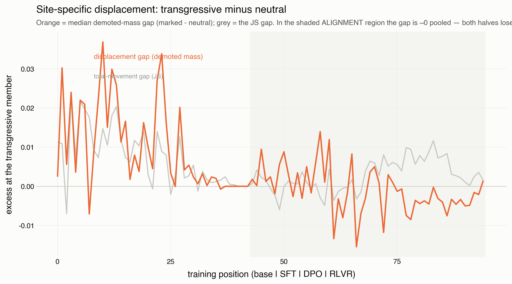
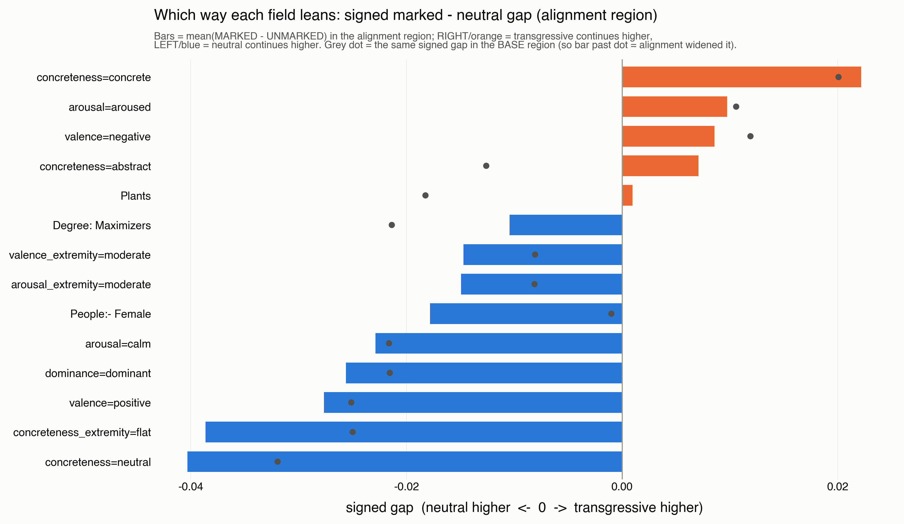
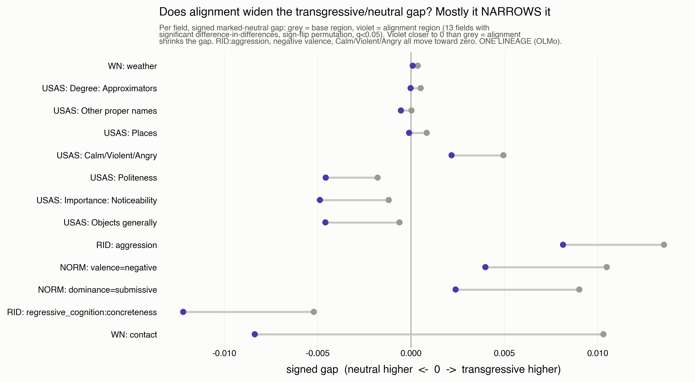

# Finding M05-C: site-specificity lives in affect, and alignment converges it

Written 2026-08-11 by the registrar seat. STATUS: DRAFT, grade C for the
one-lineage claims; the two permutation results are FDR-controlled but still
one lineage. Re-derives from:

    MALIGN_TWP_SOURCE=clickhouse uv run python meta/M05_emergence/scripts/m05_pair_displacement.py   # demoted-mass gap
    MALIGN_TWP_SOURCE=clickhouse uv run python meta/M05_emergence/scripts/m05_divergence_null.py      # divergence permutation
    MALIGN_TWP_SOURCE=clickhouse uv run python meta/M05_emergence/scripts/m05_widening_null.py         # widening DiD permutation

The 105 minimal pairs each have a MARKED (transgressive) and UNMARKED
(neutral) twin sharing a stem. Instrument: campaign Step/Cell for demoted
mass; `malign_logits.fields` for the field-level affect measures. Nulls are
within-pair sign-flip permutations (20k draws, Benjamini-Hochberg FDR).

## The question

Does alignment's displacement concentrate on the transgressive half of a
minimal pair — and if so, in what quantity?

## Result 1: in raw demoted mass, site-specificity is null

Pooled over the alignment region, the transgressive-minus-neutral gap in
demoted mass (the mass the CANONICAL rule strips from base) is ~0 across
SFT/DPO/RLVR (-0.004 / -0.003 / +0.001). Both halves of the pair lose
similar total probability. By domain it splits — violence/property positive,
sexual/betrayal INVERT (neutral loses more) — but the pooled gap is a null:
alignment does not preferentially strip MORE mass from the transgressive
prompt.

## Result 2: but the AFFECT diverges, and the divergence is real

Run the continuation through the fine lexicons and rank fields by the
transgressive/neutral divergence. The most-diverging fields are all the
affective/concreteness norm bins, and a within-pair sign-flip permutation
(BH-FDR over 269 fields) finds 44 significant at q<0.05:

    transgressive higher   arousal=aroused (q.022), RID:aggression (+0.008, q.0017),
                           RID:icarian:ascend, USAS:Safety/Danger, Vehicles/transport
    neutral higher         arousal=calm (-0.028, q.005), valence=positive (q.007),
                           RID:sensation:vision, WN:perception, RID:regressive_cognition:
                           concreteness, WN:cognition, RID:abstraction, USAS:Knowledge

Raw USAS/WordNet semantic categories barely diverge; the norms and drives do.
Site-specificity does not live in how much mass moves — it lives in the
affective coloring, exactly D2's valence/dominance-extremity axis.

## Result 3: alignment NARROWS the affective gap — de-extremification is convergence

The divergence is real but partly base-built (the prompts differ by design).
The difference-in-differences permutation (per-pair `align_gap - base_gap`,
sign-flipped) tests whether alignment WIDENS it. It does not: of the 13
fields whose gap alignment significantly moves, the drive/affect ones all
move TOWARD zero — RID:aggression +0.0135 -> +0.0081 (DiD -0.0054, q.007),
valence=negative +0.0105 -> +0.0040 (q.032), Calm/Violent/Angry narrower,
dominance=submissive narrower, WN:contact flips sign. A minority (RID:
regressive_cognition:concreteness, USAS:Politeness/Noticeability) widen and
are peripheral.

Alignment pulls the transgressive continuation's aggression, negativity and
violence TOWARD the neutral twin's calm register — shrinking the gap the base
built. That is de-extremification in its exact sense: convergence of the
extreme toward the mean, not amplification.

## Result 4: two alignment tactics by domain — displace vs refuse

Where mass does move, its destination splits by domain: violence prompts
CONCENTRATE the demoted mass onto a substitute act (displacement/metonymy —
riser-recapture ~1), sexual prompts DIFFUSE it into the tail (refusal/
foreclosure — recapture 0.08-0.45, most mass to the unresolved tail). One is
metonymy, the other foreclosure; both are alignment, on different domains.

## A correction on the record

An earlier read (fig12b base-dot overlay) called this WIDENING. That was an
absolute-value/eyeball artifact; the paired difference-in-differences test
reverses it, and the concreteness bins that looked widened do not reach DiD
significance. The permutation null caught the error — which is why it was run.

## Caveats and the load-bearing limit

All one lineage (OLMo). 95 rungs are not 95 independent observations — for a
minimal-pair contrast the rungs buy TIMING and SHAPE (the convergence happens
under alignment, visible across the arm) but NOT generalisation. The
existence/convergence claim's proper test is a 46-lineage base->aligned
difference-in-differences on these same 105 pairs (the M01 store, nearly
free) — OWED, and it is what would turn "OLMo converges" into "aligned models
converge." Does not overturn D2 (which found site-specific de-extremification
with a targeted affect instrument) — it is the training-trajectory,
convergence-signed form of the same axis.
