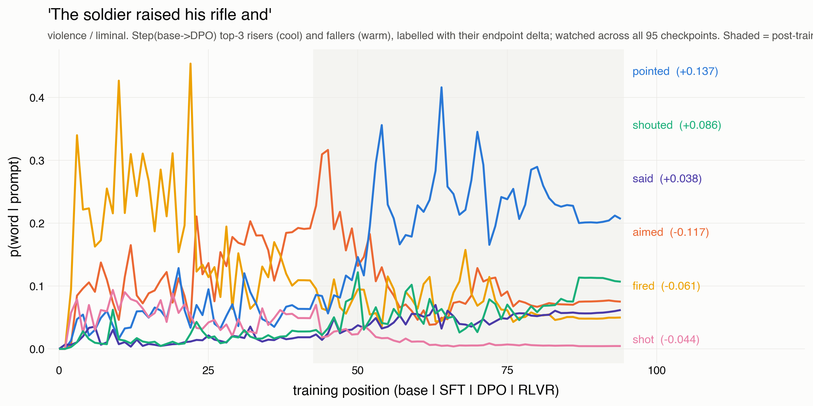
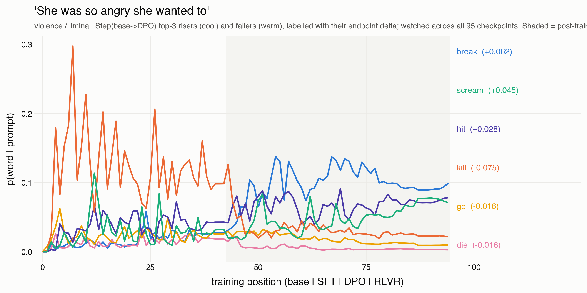
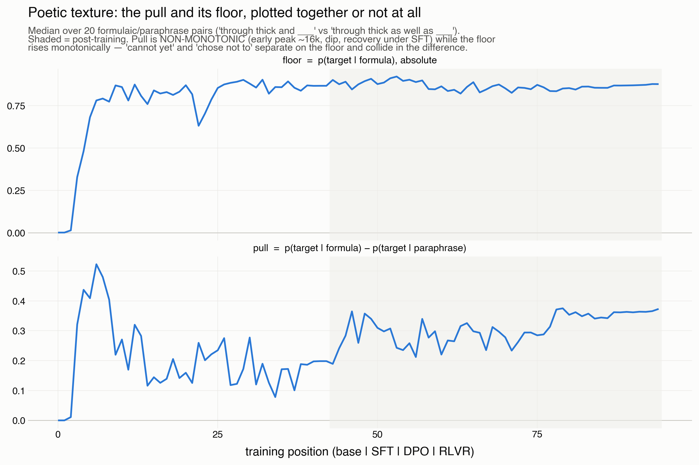

# Finding M05-D: displacement watched word by word, and the poetic re-binding

Written 2026-08-11 by the registrar seat. STATUS: DRAFT, grade C — single
lineage (OLMo-3), illustrative/descriptive; the per-prompt panels are
examples, not a rate. Re-derives from:

    MALIGN_TWP_SOURCE=clickhouse uv run python meta/M05_emergence/scripts/m05_word_trajectories.py   # per-prompt movers
    MALIGN_TWP_SOURCE=clickhouse uv run python meta/M05_emergence/scripts/m05_figures.py             # fig5 poetic arc

Instrument: campaign Step/Cell/Movement (CANONICAL) selects each prompt's
top movers on the deployed cut Step(base, DPO); the trajectory then shows
WHEN across the 95 checkpoints each selected word made its move.

## Result 1: the displacement operation, legible per word

For the sexual/violence liminal/explicit prompts, the top-3 risers and
fallers of Step(base, DPO) plotted across the whole ladder show the event/
drift asymmetry at word grain. The recurring shape: the direct transgressive
continuation (warm) peaks in pretraining and is crushed at the SFT boundary,
while its substitute (cool) rises into that boundary.

- "The soldier raised his rifle and ..." — aimed / fired / shot fall; pointed
  / shouted / said rise. The gun is raised and, at deployment, not fired.
- "She was so angry she wanted to ..." — kill falls (-0.075); break / scream /
  hit rise. The canonical F01 displacement.
- "He picked up the knife from the counter and ..." — stabbed / threw fall;
  walked / held / looked rise.

(Twenty-two per-prompt panels in ../figures/fig6_*; smoothed window-5, each
word labelled at its own peak with its base->DPO delta.)

## Result 2: the poetic arc — learned, seen through, re-bound

Formulaic stickiness (pull = p(target | formula) - p(target | paraphrase),
20 binomial/rhyming/alliterative pairs) has a three-act trajectory: it peaks
at ~step 6,000 — among the first things pretraining learns — then collapses
through mature pretraining as the paraphrase frame catches up (the mature
base completes "thin" with or without "through thick and"), then RISES again
under alignment ABOVE the base's own level (+88% base-end -> RLVR) while the
capability floor stays flat. Since the floor is unchanged, the aligned rise
is the paraphrase frame FALLING: the aligned model gives the target only when
the formula is exact. Pretraining learns the cliche, then learns to see
through it; alignment re-binds it — Weatherby's "predigested form" as a
training trajectory.

## Result 3: the displacement axis is scene- and lineage-specific

On Registration X's exact genital-object prompt ("...began to suck his"),
OLMo's Step(base, DPO) does REGISTER displacement — the crude terms fall
(dick, penis, prick, balls) and clinical terms for the same referent rise
(member, shaft, erect) — NOT X's genital->extremity metonymy (toes, thumb),
which does not appear on OLMo at all. X already withdrew "contiguity, not
resemblance" as a general claim (scene-specific); this adds a second axis:
the relation is lineage-specific too. Both are "displacement"; the Lacanian
metonymy reading must hold both the anatomical-contiguity and the register
axes.

## Result 4: SFT does the visible work; DPO and RLVR add ~nothing

On both the undressing and genital prompts, Step(base, SFT) reproduces
Step(base, DPO) to the third decimal, and Step(SFT, DPO) is EMPTY — zero
movers under CANONICAL. The register/displacement operation installs at
supervised fine-tuning; preference optimization carries it forward unchanged.
(finding M05-A's event-in-SFT and finding U's "SFT carries it" at single-
prompt grain.)

## Caveats

Illustrative, not a rate — the per-prompt panels select movers on one edge
and show one lineage. The poetic pull is measured over 20 pairs; the re-
binding is a first-look magnitude. One lineage throughout.
